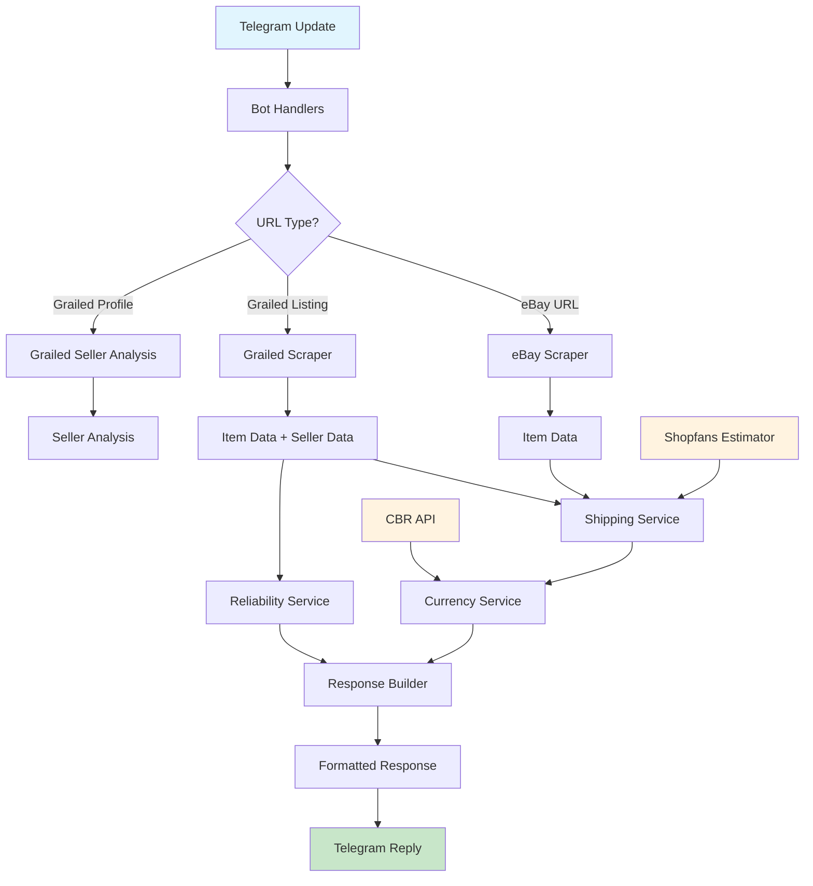

# Price Bot for Telegram

A Telegram bot that calculates total costs for eBay and Grailed listings including shipping to Russia and commission fees, with comprehensive seller reliability analysis.

## Quick Start

### Install & Run
```bash
# Install dependencies
pip install -r requirements.txt

# Set environment variable
export BOT_TOKEN="your_telegram_bot_token"

# Run locally (polling mode)
python -m app.main
```

### Deploy to Railway
The bot automatically detects Railway environment and switches to webhook mode:
```bash
railway up
```

## Architecture

The application follows a modular async architecture with clear separation of concerns:



### Core Components

- **Bot Handlers** (`app/bot/`): Message processing and user interaction
- **Scrapers** (`app/scrapers/`): eBay and Grailed data extraction
- **Services** (`app/services/`): Business logic for currency, shipping, reliability
- **Models** (`app/models.py`): Type-safe data structures with Pydantic
- **Configuration** (`app/config.py`): Environment and YAML config management

## Key Workflows

### Price Calculation Flow
1. **URL Detection**: Extract marketplace URLs from user message
2. **Concurrent Scraping**: Fetch item data and seller info in parallel
3. **Shipping Estimation**: Calculate US shipping + Russia delivery (Shopfans)
4. **Commission Application**: $15 fixed (<$150) or 10% markup (≥$150)
5. **Currency Conversion**: USD to RUB via Central Bank of Russia API (+5%)
6. **Response Formatting**: Structured message with pricing breakdown

### Grailed Seller Analysis Flow
1. **Profile Detection**: Identify seller profile URLs vs item listings
2. **Data Extraction**: Scrape ratings, reviews, badges, activity from profile
3. **Reliability Scoring**: 100-point system across 4 criteria
4. **Category Assignment**: Diamond/Gold/Silver/Bronze/Ghost tiers
5. **Response Generation**: Detailed analysis with recommendations

## Environment Variables

| Variable | Required | Description | Default |
|----------|----------|-------------|---------|
| `BOT_TOKEN` | ✅ | Telegram bot token from @BotFather | - |
| `PORT` | ❌ | Server port for webhook mode | 8000 |
| `RAILWAY_PUBLIC_DOMAIN` | ❌ | Railway domain for webhooks | - |
| `RAILWAY_URL` | ❌ | Railway URL (fallback for webhooks) | - |

## Bot Features

### Supported Platforms
- **eBay**: Price and shipping extraction with title analysis
- **Grailed**: Full item + seller analysis with buyability detection
- **Grailed app.link**: Automatic shortlink resolution

### Commission Structure
- **Items < $150**: Fixed $15 commission
- **Items ≥ $150**: 10% markup
- **Example**: $89.99 + $12.50 shipping = $102.49 → **$117.49** (₽9,820)

### Seller Reliability System (Grailed)

**4-Criteria Scoring (100 points total):**
- 🔄 **Activity (0-30)**: Days since last listing update
- ⭐ **Rating (0-35)**: Average seller rating (0-5.0 scale)
- 📊 **Review Volume (0-25)**: Total number of reviews  
- ✅ **Badge (0-10)**: Trusted Seller verification status

**Reliability Categories:**
- 💎 **Diamond (85-100)**: Top-tier seller, safe to purchase
- 🥇 **Gold (70-84)**: High reliability, recommended
- 🥈 **Silver (55-69)**: Normal reliability, verify details
- 🥉 **Bronze (40-54)**: Increased risk, use secure payment
- 👻 **Ghost (<40 or >30 days inactive)**: Low reliability, high risk

### Response Examples

**Price Calculation:**
```
Цена: $89.99 + $12.50 доставка по США + $16.99 доставка РФ = $119.48
С учетом комиссии $15: $134.48 (₽11,254)

💎 Продавец: Diamond (92/100)
📊 Продавец топ-уровня, можно брать без лишних вопросов
```

**Seller Analysis:**
```
💎 Анализ продавца Grailed

Надёжность: Diamond (92/100)
Продавец топ-уровня, можно брать без лишних вопросов

Детали:
• Активность: 30/30 (обновления сегодня)
• Рейтинг: 35/35 (4.9/5.0)
• Отзывы: 25/25 (245 отзывов)  
• Бейдж: 10/10 (✅ Проверенный продавец)
```

## Development

### Contribution Guidelines
```bash
# Code quality checks
ruff .                    # Linting
pydocstyle .             # Docstring validation
pytest -q                # Tests

# Documentation
mkdocs serve             # Serve docs locally
mkdocs build             # Build documentation
```

### Testing
```bash
# Run all tests
pytest

# Run specific test modules  
pytest tests/test_scrapers.py
pytest tests/test_currency.py
pytest tests/test_shipping.py
pytest tests/test_reliability.py
```

### Architecture Notes
- **Async I/O**: Full `aiohttp` implementation with connection pooling
- **Type Safety**: Pydantic models with validation throughout
- **Error Handling**: Comprehensive logging and admin notifications
- **Configuration**: YAML files for business rules, environment for secrets
- **Scalability**: Concurrent processing and efficient session management

## Changelog

### Recent Updates
- **v2.0** - Complete modular refactor with async architecture
- **v1.8** - Enhanced seller data extraction with robust pattern matching  
- **v1.7** - Grailed seller reliability analysis system
- **v1.6** - Central Bank of Russia currency integration
- **v1.5** - Shopfans shipping estimation with pattern matching

### Technical Improvements
- Migrated from monolithic structure to modular packages
- Replaced synchronous `requests` with async `aiohttp`
- Added comprehensive type safety with Pydantic models
- Implemented external YAML configuration for business rules
- Enhanced error handling and admin notification system

---

*For detailed development guidance and internal architecture documentation, see [CLAUDE.md](CLAUDE.md)*