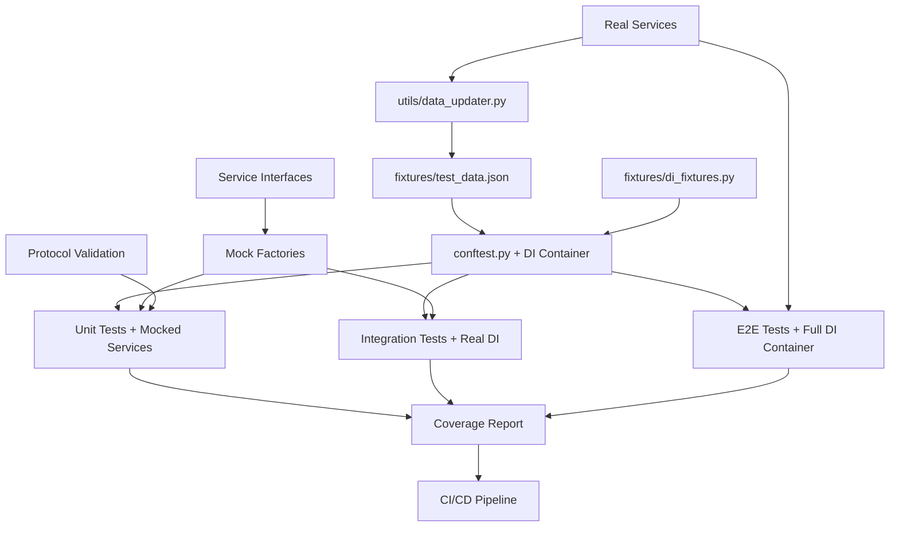

# 🧪 Исчерпывающая документация по тестированию

Полное руководство по системе тестирования Price-GH-Bot с современной SOLID архитектурой, dependency injection и трёхуровневой пирамидой тестов.

## 📑 Содержание

1. [Обзор системы тестирования](#обзор-системы-тестирования)
2. [Архитектура тестов](#архитектура-тестов)
3. [Dependency Injection в тестах](#dependency-injection-в-тестах)
4. [Настройка и установка](#настройка-и-установка)
5. [Запуск тестов](#запуск-тестов)
6. [Типы тестов](#типы-тестов)
7. [Написание новых тестов](#написание-новых-тестов)
8. [CI/CD интеграция](#cicd-интеграция)
9. [Отладка и диагностика](#отладка-и-диагностика)
10. [Автообновление данных](#автообновление-данных)
11. [Лучшие практики](#лучшие-практики)

---

## Обзор системы тестирования

### 🎯 Цели системы

Система тестирования Price-GH-Bot решает ключевые проблемы модернизированной архитектуры:

- **Предотвращение регрессий**: Автоматическое выявление поломок при изменениях SOLID компонентов
- **Контрактное тестирование**: Проверка интерфейсов и протоколов dependency injection
- **Интеграционная проверка**: Тестирование взаимодействия сервисов через DI контейнер
- **Реальная валидация**: Проверка работы с живыми внешними сервисами
- **Быстрая обратная связь**: Мгновенное обнаружение проблем при разработке
- **Архитектурная валидация**: Соблюдение SOLID принципов и чистой архитектуры

### 🏗️ Принципы архитектуры

1. **Пирамида тестов**: Много быстрых unit тестов, меньше медленных E2E
2. **Изоляция через DI**: Каждый тест использует изолированные dependency injection контейнеры
3. **Моки для интерфейсов**: Protocol-based мокирование для быстрых unit/integration тестов
4. **Реальные сервисы**: E2E тесты используют настоящие API и dependency injection
5. **Автообновление**: Тестовые данные синхронизируются с реальностью
6. **SOLID валидация**: Тесты проверяют соблюдение принципов чистой архитектуры

### 📊 Метрики качества

- **Покрытие кода**: Минимум 70%, цель 80%+ (включая все слои архитектуры)
- **Скорость выполнения**: Unit < 1с, Integration < 5с, E2E < 60с
- **Стабильность**: 95%+ успешных прогонов в CI/CD
- **Обнаружение багов**: Каждый баг должен приводить к новому тесту
- **Архитектурное соответствие**: 100% соблюдение SOLID принципов

---

## Архитектура тестов

### 📁 Структура директорий (обновлённая для SOLID архитектуры)

```
tests_new/
├── unit/                           # Быстрые изолированные тесты (с DI моками)
│   ├── core/                       # Тесты инфраструктурного слоя
│   │   ├── test_container.py           # Dependency injection контейнер
│   │   ├── test_service_locator.py     # Service locator паттерн
│   │   └── test_interfaces.py          # Валидация протоколов и интерфейсов
│   ├── services/                   # Тесты бизнес-логики
│   │   ├── test_commission_contracts.py    # Контракты расчёта комиссии
│   │   ├── test_shipping_contracts.py      # Контракты расчёта доставки
│   │   ├── test_currency_contracts.py      # Контракты конвертации валют
│   │   ├── test_reliability_contracts.py   # Контракты анализа продавцов
│   │   └── test_customs_contracts.py       # Контракты расчёта пошлин
│   ├── scrapers/                   # Тесты слоя доступа к данным
│   │   ├── test_scraper_protocol.py        # ScraperProtocol валидация
│   │   ├── test_ebay_scraper.py           # eBay scraper unit тесты
│   │   └── test_grailed_scraper.py        # Grailed scraper unit тесты
│   └── bot/                        # Тесты слоя представления
│       ├── test_url_processor.py          # URL обработка
│       ├── test_response_formatter.py     # Форматирование ответов
│       ├── test_error_boundary.py         # Error boundary система
│       └── test_analytics_tracker.py     # Аналитика и трекинг
├── integration/                    # Тесты взаимодействия компонентов (с DI)
│   ├── test_di_integration.py          # Интеграция dependency injection
│   ├── test_scraping_orchestrator.py   # Координация scraping операций
│   ├── test_bot_handlers_integration.py # Интеграция bot handlers
│   └── test_service_communication.py   # Взаимодействие сервисов
├── e2e/                           # Сквозные тесты (с полным DI контейнером)
│   ├── test_real_urls.py               # Тесты с реальными URL
│   ├── test_full_workflow.py           # Полные пользовательские сценарии
│   └── test_error_scenarios.py         # Сценарии обработки ошибок
├── fixtures/                      # Тестовые данные и фикстуры
│   ├── test_data.json                  # Основные тестовые данные
│   ├── di_fixtures.py                  # DI контейнер фикстуры
│   └── generated_fixtures.py           # Автогенерируемые фикстуры
├── utils/                         # Утилиты для тестирования
│   ├── data_updater.py                 # Автообновление тестовых данных
│   ├── di_test_helpers.py             # Помощники для DI тестирования
│   └── mock_factories.py              # Фабрики моков для интерфейсов
├── conftest.py                    # Глобальные фикстуры pytest с DI
└── README.md                      # Краткое руководство
```

### 🔄 Поток данных в тестах (с Dependency Injection)



---

## Dependency Injection в тестах

### 🔧 Настройка DI контейнера для тестов

Каждый уровень тестирования использует свою конфигурацию dependency injection:

#### Unit Tests - Полностью мокированные зависимости

```python
@pytest.fixture
def unit_test_container():
    """DI контейнер с полностью мокированными сервисами."""
    container = Container()
    
    # Моки для всех интерфейсов
    container.register(ICurrencyService, MockCurrencyService, lifetime=Lifetime.SINGLETON)
    container.register(IReliabilityService, MockReliabilityService, lifetime=Lifetime.SINGLETON)
    container.register(IShippingService, MockShippingService, lifetime=Lifetime.SINGLETON)
    container.register(IMarketplaceScraper, MockEbayScraper, lifetime=Lifetime.TRANSIENT)
    
    return container
```

#### Integration Tests - Частично реальные сервисы

```python
@pytest.fixture
def integration_test_container():
    """DI контейнер с реальными бизнес-сервисами и мокированными внешними API.""" 
    container = Container()
    
    # Реальные бизнес-сервисы
    container.register(IReliabilityService, ReliabilityService, lifetime=Lifetime.SINGLETON)
    container.register(IShippingService, ShippingService, lifetime=Lifetime.SINGLETON)
    
    # Мокированные внешние зависимости
    container.register(ICurrencyService, MockCurrencyService, lifetime=Lifetime.SINGLETON)
    container.register(IMarketplaceScraper, MockEbayScraper, lifetime=Lifetime.TRANSIENT)
    
    return container
```

#### E2E Tests - Полный реальный контейнер

```python
@pytest.fixture
def e2e_test_container():
    """Полный DI контейнер с реальными сервисами для E2E тестирования."""
    container = Container()
    
    # Полная конфигурация как в production
    container.register(ICurrencyService, CurrencyService, lifetime=Lifetime.SINGLETON)
    container.register(IReliabilityService, ReliabilityService, lifetime=Lifetime.SINGLETON)
    container.register(IShippingService, ShippingService, lifetime=Lifetime.SINGLETON)
    container.register(IMarketplaceScraper, EbayScraper, lifetime=Lifetime.TRANSIENT)
    container.register(IMarketplaceScraper, GrailedScraper, lifetime=Lifetime.TRANSIENT)
    
    return container
```

### 🎭 Mock Factories для Protocol-based тестирования

```python
class MockCurrencyService:
    """Mock реализация ICurrencyService для unit тестов."""
    
    async def get_usd_to_rub_rate(self, session) -> Optional[CurrencyRate]:
        return CurrencyRate(rate=90.0, source="mock", timestamp=datetime.now())
    
    async def get_eur_to_usd_rate(self, session) -> Optional[CurrencyRate]:
        return CurrencyRate(rate=1.1, source="mock", timestamp=datetime.now())
```

---

## Настройка и установка

### 🔧 Системные требования

- **Python 3.11+**: Основной интерпретатор с поддержкой современных типов
- **Docker**: Для изолированного тестирования с DI контейнерами
- **Playwright**: Для headless browser тестов
- **Git**: Для pre-commit хуков

### 📦 Установка зависимостей

```bash
# 1. Основные зависимости
pip install -r requirements.txt -r requirements-dev.txt

# 2. Browser для E2E тестов
playwright install chromium

# 3. Pre-commit хуки (опционально)
pre-commit install

# 4. Проверка установки
pytest --version
playwright --version
```

### 🌍 Переменные окружения

#### Обязательные
```bash
# Токен тестового бота
export BOT_TOKEN=8026508902:AAGWJKei_EyPkpc4x-lt-qFQo53829gQIrU
```

#### Опциональные
```bash
# Режим headless browser (по умолчанию: false в тестах)
export ENABLE_HEADLESS_BROWSER=true

# Уровень логирования (по умолчанию: INFO)
export LOG_LEVEL=DEBUG

# Маркер тестового окружения
export ENVIRONMENT=test

# Timeout для медленных тестов (секунды)
export TEST_TIMEOUT=120
```

### ⚙️ Конфигурационные файлы

#### pytest.ini
```ini
[tool:pytest]
testpaths = tests_new
addopts = --strict-markers --verbose --tb=short --cov-config=.coveragerc
markers = 
    unit: Быстрые изолированные тесты
    integration: Тесты взаимодействия компонентов
    e2e: Сквозные тесты с реальными сервисами
    slow: Медленные тесты (>5 секунд)
    network: Тесты, требующие сетевого доступа
```

#### .coveragerc
```ini
[run]
source = app
branch = True
omit = tests_new/*, venv/*

[report]
fail_under = 70
show_missing = True
```

---

## Запуск тестов

### 🏃‍♂️ Командная строка

#### Базовые команды
```bash
# Все unit тесты (быстро, ~10 секунд)
BOT_TOKEN=8026508902:AAGWJKei_EyPkpc4x-lt-qFQo53829gQIrU pytest tests_new/unit/ -v

# Все integration тесты (~30 секунд)
BOT_TOKEN=8026508902:AAGWJKei_EyPkpc4x-lt-qFQo53829gQIrU pytest tests_new/integration/ -v

# Все E2E тесты (медленно, ~5 минут)
BOT_TOKEN=8026508902:AAGWJKei_EyPkpc4x-lt-qFQo53829gQIrU ENABLE_HEADLESS_BROWSER=true pytest tests_new/e2e/ -v

# Все тесты подряд
BOT_TOKEN=8026508902:AAGWJKei_EyPkpc4x-lt-qFQo53829gQIrU pytest tests_new/ -v
```

#### Специальные режимы
```bash
# С покрытием кода
pytest tests_new/ --cov=app --cov-report=html --cov-report=term

# Остановиться на первой ошибке
pytest tests_new/ -x

# Запустить только неудавшиеся тесты
pytest tests_new/ --lf

# Максимальная детализация
pytest tests_new/ -v -s --tb=long

# Конкретный тест
pytest tests_new/unit/test_commission_contracts.py::TestCommissionContracts::test_commission_calculation_contract -v

# Тесты по маркеру
pytest tests_new/ -m "unit and not slow" -v

# Параллельное выполнение
pytest tests_new/ -n auto
```

### 🛠️ Makefile команды

```bash
# Базовые команды
make test-unit           # Быстрые unit тесты
make test-integration    # Integration тесты
make test-e2e           # E2E тесты
make test-all           # Все тесты последовательно
make test-coverage      # Тесты с отчётом покрытия

# Docker команды  
make test-docker        # Все тесты в Docker
make test-docker-unit   # Unit тесты в Docker
make test-docker-dev    # Development окружение

# Утилиты
make test-update-data   # Обновление тестовых данных
make test-verify        # Проверка доступности URL
make clean-test         # Очистка артефактов
```

### 🐳 Docker режимы

#### Изолированное выполнение
```bash
# Все тесты в изолированном окружении
docker-compose -f docker-compose.test.yml up test-all --build

# Отдельные уровни тестов
docker-compose -f docker-compose.test.yml up test-unit --build
docker-compose -f docker-compose.test.yml up test-integration --build
docker-compose -f docker-compose.test.yml up test-e2e --build

# С отчётом покрытия
docker-compose -f docker-compose.test.yml up test-coverage --build
```

#### Development режим
```bash
# Запуск development контейнера
docker-compose -f docker-compose.test.yml up test-dev -d

# Подключение к контейнеру
docker exec -it $(docker-compose -f docker-compose.test.yml ps -q test-dev) bash

# Внутри контейнера
pytest tests_new/unit/ -v
pytest tests_new/integration/ -v --pdb  # С отладчиком
```

---

## Типы тестов

### 🎯 Unit тесты (tests_new/unit/) - с Dependency Injection

**Назначение**: Тестирование изолированных сервисов и компонентов через интерфейсы

**Характеристики**:
- Выполнение < 1 секунды каждый
- Полная изоляция через DI контейнер с моками
- Protocol-based тестирование интерфейсов
- Детерминированные результаты

#### Unit/Core - Тестирование инфраструктуры DI

```python
# tests_new/unit/core/test_container.py
async def test_dependency_injection_container_registration():
    """Тест регистрации сервисов в DI контейнере."""
    container = Container()
    container.register(ICurrencyService, CurrencyService, lifetime=Lifetime.SINGLETON)
    
    # Проверяем корректность разрешения зависимостей
    service = container.resolve(ICurrencyService)
    assert isinstance(service, CurrencyService)
    
    # Проверяем singleton lifetime
    service2 = container.resolve(ICurrencyService)
    assert service is service2
```

#### Unit/Services - Тестирование бизнес-логики

```python
# tests_new/unit/services/test_commission_contracts.py
def test_commission_calculation_with_di_container(unit_test_container):
    """Тест расчёта комиссии через DI контейнер."""
    # Resolve зависимостей через DI
    currency_service = unit_test_container.resolve(ICurrencyService)
    shipping_service = unit_test_container.resolve(IShippingService)
    
    # Тест бизнес-логики
    result = calculate_final_price(
        item_price=Decimal("120.00"),
        us_shipping=Decimal("25.00"),
        russia_shipping=shipping_service.estimate_shipping_cost("hoodie", 145.0)
    )
    assert result.commission == Decimal("15.00")  # Fixed commission <$150
```

#### Unit/Scrapers - Тестирование ScraperProtocol

```python
# tests_new/unit/scrapers/test_scraper_protocol.py
async def test_scraper_protocol_compliance():
    """Тест соответствия ScraperProtocol всех реализаций."""
    scrapers = [EbayScraper(), GrailedScraper()]
    
    for scraper in scrapers:
        # Проверяем наличие всех методов протокола
        assert hasattr(scraper, 'scrape_item')
        assert hasattr(scraper, 'scrape_seller')
        assert hasattr(scraper, 'supports_url')
        assert hasattr(scraper, 'is_seller_profile')
        
        # Тест типов возвращаемых значений
        assert isinstance(scraper.supports_url("https://example.com"), bool)
```

#### Unit/Bot - Тестирование слоя представления

```python
# tests_new/unit/bot/test_error_boundary.py  
async def test_error_boundary_classification(unit_test_container):
    """Тест классификации ошибок Error Boundary."""
    error_boundary = unit_test_container.resolve(IErrorBoundary)
    
    # Тест различных типов ошибок
    network_error = aiohttp.ClientError("Connection failed")
    classification = error_boundary.classify_error(network_error)
    
    assert classification['category'] == 'network_error'
    assert classification['user_message'] is not None
    assert classification['should_retry'] == True
```

**Тестируемые сценарии Unit уровня**:
- DI контейнер: регистрация, разрешение, lifetime управление
- Сервисы: изолированное тестирование бизнес-логики через интерфейсы
- Протоколы: соответствие всех реализаций ScraperProtocol
- Error Boundary: классификация ошибок и выбор стратегии обработки
- Слой представления: форматирование ответов, валидация URL

### 🔗 Integration тесты (tests_new/integration/) - с реальными сервисами

**Назначение**: Тестирование взаимодействия компонентов через настоящий DI контейнер

**Характеристики**:
- Выполнение < 5 секунд каждый
- Частично реальные сервисы, частично моки
- Тестирование сложных взаимодействий
- Проверка корректной интеграции слоёв

#### test_di_integration.py
```python
async def test_service_orchestration_through_di():
    """Тест оркестрации сервисов через DI контейнер."""
    container = create_integration_test_container()
    
    # Полный поток с частично реальными сервисами
    orchestrator = container.resolve(IScrapingOrchestrator)
    formatter = container.resolve(IResponseFormatter)
    
    # Тест координации между сервисами
    results = await orchestrator.process_urls_concurrent(test_urls, user_id=123)
    formatted_response = await formatter.format_item_response(results[0])
    
    assert "Расчёт стоимости" in formatted_response
```

#### test_scraping_orchestrator.py
```python
async def test_concurrent_scraping_coordination(integration_test_container):
    """Тест координации параллельного scraping."""
    orchestrator = integration_test_container.resolve(IScrapingOrchestrator)
    
    # Тест обработки смешанных URL (eBay + Grailed)
    mixed_urls = [
        "https://www.ebay.com/itm/123456789",
        "https://www.grailed.com/listings/123456", 
        "https://www.grailed.com/username"  # Profile URL
    ]
    
    results = await orchestrator.process_urls_concurrent(mixed_urls, user_id=123)
    
    # Проверяем правильную категоризацию и обработку
    assert len(results) == 3
    assert any(r['type'] == 'item_listing' for r in results)
    assert any(r['type'] == 'seller_profile' for r in results)
```

**Тестируемые сценарии Integration уровня**:
- DI оркестрация: взаимодействие сервисов через контейнер
- Scraping координация: параллельная обработка URL разных типов
- Обработка данных: поток от извлечения до форматирования
- Error handling: обработка ошибок на границах сервисов
- Analytics: сбор метрик взаимодействий компонентов

### 🌐 E2E тесты (tests_new/e2e/) - с полным DI контейнером

**Назначение**: Сквозное тестирование полного workflow с реальными сервисами

**Характеристики**:
- Выполнение < 60 секунд каждый
- Полный production DI контейнер
- Реальные внешние API и сервисы
- Валидация пользовательских сценариев

#### test_full_workflow.py
```python
async def test_complete_user_workflow_with_di():
    """Тест полного пользовательского workflow через DI."""
    # Инициализация полного production контейнера
    container = create_e2e_test_container()
    
    # Получение всех необходимых сервисов через DI
    url_processor = container.resolve(IURLProcessor)
    orchestrator = container.resolve(IScrapingOrchestrator)
    formatter = container.resolve(IResponseFormatter)
    error_boundary = container.resolve(IErrorBoundary)
    
    try:
        # Симуляция пользовательского сообщения
        user_message = "https://www.grailed.com/listings/59397754"
        
        # Полный поток обработки
        processed_urls = url_processor.process_message(user_message, user_id=123)
        results = await orchestrator.process_urls_concurrent(
            processed_urls['valid_urls'], 
            user_id=123
        )
        response = await formatter.format_item_response(results[0])
        
        # Проверка результата
        assert "Расчёт стоимости" in response
        assert "Товар:" in response
        assert "₽" in response  # RUB conversion
        
    except Exception as e:
        # Тест error boundary в реальных условиях
        handled = await error_boundary.handle_error(e, context={"user_id": 123})
        assert handled is True
```

#### test_real_urls.py  
```python
async def test_grailed_with_seller_analysis_e2e(e2e_test_container):
    """E2E тест Grailed с анализом продавца."""
    orchestrator = e2e_test_container.resolve(IScrapingOrchestrator)
    
    # Реальный Grailed URL
    test_url = "https://www.grailed.com/listings/59397754"
    
    results = await orchestrator.process_urls_concurrent([test_url], user_id=123)
    
    if not results or results[0].get('error'):
        pytest.skip("Grailed listing not accessible")
    
    result = results[0]
    
    # Проверка полного результата
    assert result['item_data']['price'] > Decimal("0")
    assert result['item_data']['title'] is not None
    assert 'seller_data' in result  # Seller analysis performed
    assert result['final_price_rub'] > 0  # Full price calculation
```

#### test_error_scenarios.py
```python
async def test_error_boundary_real_scenarios(e2e_test_container):
    """Тест Error Boundary с реальными сценариями ошибок."""
    orchestrator = e2e_test_container.resolve(IScrapingOrchestrator)
    error_boundary = e2e_test_container.resolve(IErrorBoundary)
    
    # Тест с недоступным URL
    invalid_urls = ["https://www.grailed.com/listings/invalid-listing-id"]
    
    results = await orchestrator.process_urls_concurrent(invalid_urls, user_id=123)
    
    # Проверка обработки ошибок
    assert len(results) == 1
    assert results[0].get('error') is not None
    assert results[0]['error']['category'] in ['scraping_error', 'not_found_error']
    assert results[0]['error']['user_message'] is not None
```

**Тестируемые сценарии E2E уровня**:
- Полный пользовательский workflow: от сообщения до ответа
- Реальные API интеграции: eBay, Grailed, CBR, Shopfans pricing
- Headless browser операции: анализ профилей продавцов Grailed
- Error handling: реальные сценарии недоступности сервисов
- Performance: время отклика полного pipeline
- Data integrity: корректность данных на всех этапах обработки
- Currency conversion: актуальные курсы валют
- Customs duty calculation: интеграция с EUR/USD rates

---

## Написание новых тестов

### 📝 Шаблон Unit теста с Dependency Injection

```python
"""Модуль для тестирования [ОПИСАНИЕ ФУНКЦИОНАЛЬНОСТИ] через DI контейнер."""

import pytest
from decimal import Decimal
from unittest.mock import AsyncMock

from app.core.interfaces import IServiceInterface
from app.services.service_to_test import ServiceToTest


class TestServiceToTest:
    """Тестирование сервиса ServiceToTest через DI."""
    
    def test_normal_case_with_di(self, unit_test_container):
        """Тест нормального случая через DI контейнер."""
        # Arrange - получение сервиса через DI
        service = unit_test_container.resolve(IServiceInterface)
        
        # Arrange - подготовка тестовых данных
        input_data = "test_input"
        expected_output = "expected_result"
        
        # Act - выполнение через DI resolved сервис
        result = service.method_to_test(input_data)
        
        # Assert - проверка результата
        assert result == expected_output, f"Expected {expected_output}, got {result}"
    
    def test_dependency_injection_resolution(self, unit_test_container):
        """Тест корректности разрешения зависимостей."""
        # Проверяем что DI корректно резолвит зависимости
        service = unit_test_container.resolve(IServiceInterface)
        assert service is not None
        assert isinstance(service, ServiceToTest)
        
        # Проверяем что зависимости тоже резолвятся
        dependency = unit_test_container.resolve(IDependencyInterface)
        assert dependency is not None
    
    async def test_async_operation_with_di(self, unit_test_container):
        """Тест асинхронной операции через DI."""
        service = unit_test_container.resolve(IServiceInterface)
        
        # Мокированные зависимости уже настроены в unit_test_container
        result = await service.async_method("test_input")
        
        assert result is not None
        assert result.status == "success"
    
    def test_error_handling_with_mocked_dependencies(self, unit_test_container):
        """Тест обработки ошибок с мокированными зависимостями."""
        service = unit_test_container.resolve(IServiceInterface)
        
        # В unit тестах внешние зависимости уже замокированы
        with pytest.raises(ValueError, match="Expected error message"):
            service.method_that_should_fail("invalid_input")
    
    @pytest.mark.parametrize("input_val,expected", [
        ("case1", "result1"),
        ("case2", "result2"),
        ("case3", "result3"),
    ])
    def test_multiple_cases_through_di(self, input_val, expected, unit_test_container):
        """Тест множественных случаев через DI."""
        service = unit_test_container.resolve(IServiceInterface)
        assert service.method_to_test(input_val) == expected
```

### 📝 Шаблон Integration теста с частично реальными сервисами

```python
"""Integration тесты для [ОПИСАНИЕ КОМПОНЕНТА] с реальными сервисами."""

import pytest
from unittest.mock import patch, AsyncMock

from app.core.interfaces import IServiceInterface, IDependencyInterface


class TestServiceIntegration:
    """Integration тестирование сервиса с реальными зависимостями."""
    
    async def test_service_interaction_through_di(self, integration_test_container):
        """Тест взаимодействия сервисов через DI контейнер."""
        # В integration тестах часть сервисов реальные, часть мокированные
        primary_service = integration_test_container.resolve(IServiceInterface)
        dependency_service = integration_test_container.resolve(IDependencyInterface)
        
        # Тестируем реальное взаимодействие
        result = await primary_service.complex_operation("test_data")
        
        # Проверяем что сервисы корректно взаимодействуют
        assert result.status == "completed"
        assert result.processed_by == dependency_service.__class__.__name__
    
    async def test_error_propagation_between_services(self, integration_test_container):
        """Тест распространения ошибок между сервисами."""
        service = integration_test_container.resolve(IServiceInterface)
        
        # Тестируем как ошибки передаются через границы сервисов
        with pytest.raises(ServiceException) as exc_info:
            await service.operation_that_depends_on_external_service()
        
        # Проверяем корректность Error Boundary
        assert exc_info.value.original_error is not None
        assert exc_info.value.service_name == "ExternalService"
    
    def test_configuration_injection(self, integration_test_container):
        """Тест инъекции конфигурации через DI."""
        service = integration_test_container.resolve(IServiceInterface)
        
        # Проверяем что конфигурация корректно инжектируется
        assert service.config is not None
        assert service.config.test_mode == True  # Integration test config
```

### 📝 Шаблон E2E теста с полным DI контейнером

```python
"""E2E тесты для [ПОЛНЫЙ WORKFLOW] с реальными сервисами."""

import pytest
import asyncio
from decimal import Decimal


class TestCompleteWorkflow:
    """E2E тестирование полного пользовательского workflow."""
    
    async def test_complete_user_scenario_e2e(self, e2e_test_container):
        """Полный E2E тест пользовательского сценария."""
        # Получение всех сервисов через production DI контейнер
        url_processor = e2e_test_container.resolve(IURLProcessor)
        orchestrator = e2e_test_container.resolve(IScrapingOrchestrator)
        formatter = e2e_test_container.resolve(IResponseFormatter)
        analytics = e2e_test_container.resolve(IAnalyticsService)
        
        # Симуляция реального пользовательского ввода
        user_input = "https://www.grailed.com/listings/real-listing-id"
        user_id = 12345
        
        # Полный workflow
        processed_urls = url_processor.process_message(user_input, user_id)
        results = await orchestrator.process_urls_concurrent(
            processed_urls['valid_urls'], 
            user_id
        )
        formatted_response = await formatter.format_item_response(results[0])
        
        # Проверка полного результата
        assert "Расчёт стоимости" in formatted_response
        assert "Товар:" in formatted_response
        assert "₽" in formatted_response
        
        # Проверка что аналитика записалась
        user_stats = analytics.get_user_stats(user_id, days=1)
        assert user_stats['total_requests'] >= 1
    
    @pytest.mark.slow  
    async def test_performance_under_load_e2e(self, e2e_test_container):
        """E2E тест производительности под нагрузкой."""
        orchestrator = e2e_test_container.resolve(IScrapingOrchestrator)
        
        # Тест с множественными одновременными запросами
        urls = [
            "https://www.ebay.com/itm/real-item-1",
            "https://www.grailed.com/listings/real-item-2",
            "https://www.grailed.com/real-seller-profile"
        ]
        
        start_time = asyncio.get_event_loop().time()
        
        # Параллельная обработка
        results = await orchestrator.process_urls_concurrent(urls, user_id=123)
        
        end_time = asyncio.get_event_loop().time()
        execution_time = end_time - start_time
        
        # Проверка производительности
        assert execution_time < 30.0  # Максимум 30 секунд для 3 URL
        assert len(results) == 3
        assert all(r.get('item_data') or r.get('seller_data') for r in results)
```

### 🔧 Конфигурация фикстур для DI

```python
# tests_new/conftest.py
import pytest
from app.core.container import Container
from app.core.interfaces import *
from tests_new.utils.mock_factories import *


@pytest.fixture
def unit_test_container():
    """DI контейнер для unit тестов с полными моками."""
    container = Container()
    
    # Регистрация мокированных сервисов
    container.register(ICurrencyService, MockCurrencyService, lifetime=Lifetime.SINGLETON)
    container.register(IReliabilityService, MockReliabilityService, lifetime=Lifetime.SINGLETON)
    container.register(IShippingService, MockShippingService, lifetime=Lifetime.SINGLETON)
    container.register(IMarketplaceScraper, MockEbayScraper, lifetime=Lifetime.TRANSIENT)
    
    return container


@pytest.fixture
def integration_test_container():
    """DI контейнер для integration тестов с частично реальными сервисами."""
    container = Container()
    
    # Реальные бизнес-сервисы
    container.register(IReliabilityService, ReliabilityService, lifetime=Lifetime.SINGLETON)
    container.register(IShippingService, ShippingService, lifetime=Lifetime.SINGLETON)
    
    # Мокированные внешние зависимости
    container.register(ICurrencyService, MockCurrencyService, lifetime=Lifetime.SINGLETON)
    
    return container


@pytest.fixture
def e2e_test_container():
    """Полный production DI контейнер для E2E тестов."""
    container = Container()
    
    # Полная конфигурация как в production
    # (см. app/core/service_locator.py)
    configure_production_container(container)
    
    return container
```

## Лучшие практики

### 🎯 SOLID принципы в тестах

1. **Single Responsibility**: Каждый тест проверяет одну конкретную функциональность
2. **Open/Closed**: Тесты легко расширяются для новых сценариев без изменения существующих
3. **Liskov Substitution**: Моки корректно заменяют реальные сервисы
4. **Interface Segregation**: Тестируются только необходимые интерфейсы
5. **Dependency Inversion**: Тесты зависят от абстракций (интерфейсов), не от конкретных реализаций

### 🏗️ Архитектурные принципы

```python
# ✅ Правильно - тестирование через интерфейс
def test_service_through_interface(unit_test_container):
    service = unit_test_container.resolve(ICurrencyService)  # Интерфейс
    result = await service.get_usd_to_rub_rate(session)
    assert result.rate > 0

# ❌ Неправильно - прямое создание экземпляра
def test_service_direct_instantiation():
    service = CurrencyService()  # Прямое создание
    result = await service.get_usd_to_rub_rate(session)
    assert result.rate > 0
```

### 📊 Покрытие и качество

#### Цели покрытия по слоям архитектуры
- **Core (DI/Interfaces)**: 95%+ - критичная инфраструктура
- **Services (Business Logic)**: 85%+ - основная бизнес-логика
- **Scrapers (Data Access)**: 75%+ - внешние интеграции
- **Bot (Presentation)**: 70%+ - пользовательский интерфейс

#### Качественные метрики
- **Cyclomatic Complexity**: < 10 для всех методов
- **Test Execution Time**: Unit < 1s, Integration < 5s, E2E < 60s
- **Flaky Test Rate**: < 1% (особенно для E2E тестов)
- **Coverage Gaps**: Нет непокрытых критических путей

### 🔄 CI/CD интеграция

#### GitHub Actions конфигурация

```yaml
# .github/workflows/test.yml
name: Comprehensive Testing

on: [push, pull_request]

jobs:
  test:
    runs-on: ubuntu-latest
    strategy:
      matrix:
        python-version: [3.11, 3.12]
    
    steps:
    - uses: actions/checkout@v4
    
    - name: Set up Python
      uses: actions/setup-python@v4
      with:
        python-version: ${{ matrix.python-version }}
    
    - name: Install dependencies
      run: |
        pip install -r requirements.txt -r requirements-dev.txt
        playwright install chromium
    
    - name: Unit tests with DI validation
      run: |
        pytest tests_new/unit/ -v --cov=app --cov-branch
        
    - name: Integration tests with service interaction
      run: |
        pytest tests_new/integration/ -v --cov=app --cov-append
        
    - name: E2E tests with real services
      run: |
        pytest tests_new/e2e/ -v --cov=app --cov-append
      env:
        BOT_TOKEN: ${{ secrets.TEST_BOT_TOKEN }}
        ENABLE_HEADLESS_BROWSER: true
    
    - name: Coverage report
      run: |
        coverage report --fail-under=70
        coverage html
    
    - name: Upload coverage to Codecov
      uses: codecov/codecov-action@v3
```

### 🛠️ Отладка и диагностика

#### Debugging DI проблем

```python
def test_debug_di_container(unit_test_container):
    """Отладка проблем с dependency injection."""
    
    # Проверка регистраций
    registrations = unit_test_container.get_registrations()
    print(f"Registered services: {list(registrations.keys())}")
    
    # Проверка разрешения
    try:
        service = unit_test_container.resolve(IProblematicService)
        print(f"Service resolved: {type(service)}")
    except Exception as e:
        print(f"Resolution failed: {e}")
        
    # Валидация зависимостей
    validation = unit_test_container.validate_services()
    if not validation['success']:
        for error in validation['errors']:
            print(f"Validation error: {error}")
```

#### Performance профилирование

```python
import cProfile
import asyncio

def test_performance_profiling(e2e_test_container):
    """Профилирование производительности."""
    
    def run_test():
        orchestrator = e2e_test_container.resolve(IScrapingOrchestrator)
        
        async def async_test():
            return await orchestrator.process_urls_concurrent(
                ["https://www.grailed.com/listings/test"], 
                user_id=123
            )
        
        return asyncio.run(async_test())
    
    # Профилирование
    profiler = cProfile.Profile()
    profiler.enable()
    
    result = run_test()
    
    profiler.disable()
    profiler.dump_stats('test_performance.prof')
    
    # Анализ результатов
    import pstats
    stats = pstats.Stats('test_performance.prof')
    stats.sort_stats('cumulative').print_stats(10)
```

### 📈 Мониторинг и метрики

#### Test Analytics Dashboard

```python
# tests_new/utils/test_analytics.py
class TestAnalytics:
    """Сбор аналитики выполнения тестов."""
    
    def collect_test_metrics(self):
        return {
            'execution_times': self.get_execution_times(),
            'failure_rates': self.get_failure_rates(),
            'coverage_trends': self.get_coverage_trends(),
            'dependency_health': self.check_dependency_health()
        }
    
    def generate_report(self):
        """Генерация отчёта для CI/CD dashboard."""
        metrics = self.collect_test_metrics()
        
        return {
            'overall_health': self.calculate_health_score(metrics),
            'recommendations': self.generate_recommendations(metrics),
            'trends': self.analyze_trends(metrics)
        }
```

### 🎯 Заключение

Система тестирования Price-GH-Bot представляет собой современную, scalable архитектуру, построенную на принципах:

- **Clean Architecture**: Чёткое разделение слоёв и ответственности
- **SOLID Principles**: Соблюдение всех принципов объектно-ориентированного дизайна  
- **Dependency Injection**: Loose coupling и лёгкое тестирование
- **Protocol-based Design**: Унификация интерфейсов и взаимозаменяемость
- **Comprehensive Coverage**: Трёхуровневая пирамида тестов (Unit/Integration/E2E)

Эта система обеспечивает:
- ✅ Высокую надёжность и стабильность
- ✅ Быструю обратную связь при разработке
- ✅ Лёгкую расширяемость для новых функций
- ✅ Автоматическую валидацию архитектурных принципов
- ✅ Полное покрытие критических пользовательских сценариев

**Для получения помощи по тестированию**:
- Изучите примеры в `tests_new/` директории
- Используйте шаблоны из этой документации
- Следуйте принципам SOLID и dependency injection
- Поддерживайте чистоту архитектуры во всех тестах