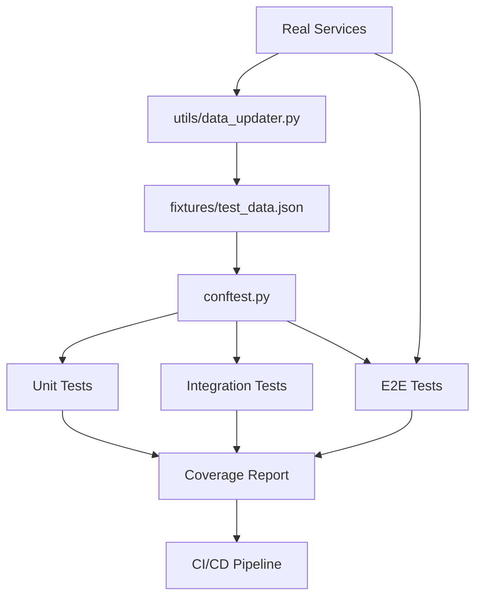
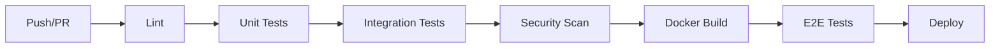

# 🧪 Исчерпывающая документация по тестированию

Полное руководство по системе тестирования Price-GH-Bot, которая обеспечивает надёжность через многоуровневые автоматизированные проверки.

## 📑 Содержание

1. [Обзор системы тестирования](#обзор-системы-тестирования)
2. [Архитектура тестов](#архитектура-тестов)
3. [Настройка и установка](#настройка-и-установка)
4. [Запуск тестов](#запуск-тестов)
5. [Типы тестов](#типы-тестов)
6. [Написание новых тестов](#написание-новых-тестов)
7. [CI/CD интеграция](#cicd-интеграция)
8. [Отладка и диагностика](#отладка-и-диагностика)
9. [Автообновление данных](#автообновление-данных)
10. [Лучшие практики](#лучшие-практики)

---

## Обзор системы тестирования

### 🎯 Цели системы

Система тестирования Price-GH-Bot решает ключевые проблемы:

- **Предотвращение регрессий**: Автоматическое выявление поломок при изменениях
- **Контрактное тестирование**: Проверка бизнес-логики на соответствие требованиям
- **Интеграционная проверка**: Тестирование взаимодействия компонентов
- **Реальная валидация**: Проверка работы с живыми внешними сервисами
- **Быстрая обратная связь**: Мгновенное обнаружение проблем при разработке

### 🏗️ Принципы архитектуры

1. **Пирамида тестов**: Много быстрых unit тестов, меньше медленных E2E
2. **Изоляция**: Каждый тест независим и детерминирован
3. **Моки для скорости**: Внешние зависимости мокаются в unit/integration тестах
4. **Реальные данные для достоверности**: E2E тесты используют настоящие API
5. **Автообновление**: Тестовые данные синхронизируются с реальностью

### 📊 Метрики качества

- **Покрытие кода**: Минимум 70%, цель 80%+
- **Скорость выполнения**: Unit < 1с, Integration < 5с, E2E < 60с
- **Стабильность**: 95%+ успешных прогонов в CI/CD
- **Обнаружение багов**: Каждый баг должен приводить к новому тесту

---

## Архитектура тестов

### 📁 Структура директорий

```
tests_new/
├── unit/                           # Быстрые изолированные тесты
│   ├── test_commission_contracts.py    # Контракты расчёта комиссии
│   ├── test_shipping_contracts.py      # Контракты расчёта доставки
│   └── test_currency_contracts.py      # Контракты конвертации валют
├── integration/                    # Тесты взаимодействия компонентов
│   └── test_bot_handlers.py            # Интеграция обработчиков бота
├── e2e/                           # Сквозные тесты с реальными сервисами
│   └── test_real_urls.py               # Тесты с реальными URL
├── fixtures/                      # Тестовые данные и фикстуры
│   ├── test_data.json                  # Основные тестовые данные
│   └── generated_fixtures.py           # Автогенерируемые фикстуры
├── utils/                         # Утилиты для тестирования
│   └── data_updater.py                 # Автообновление тестовых данных
├── conftest.py                    # Глобальные фикстуры pytest
└── README.md                      # Краткое руководство
```

### 🔄 Поток данных в тестах



---

## Настройка и установка

### 🔧 Системные требования

- **Python 3.11+**: Основной интерпретатор
- **Docker**: Для изолированного тестирования
- **Playwright**: Для headless browser тестов
- **Git**: Для pre-commit хуков

### 📦 Установка зависимостей

```bash
# 1. Основные зависимости
pip install -r requirements.txt -r requirements-dev.txt

# 2. Browser для E2E тестов
playwright install chromium

# 3. Pre-commit хуки (опционально)
pre-commit install

# 4. Проверка установки
pytest --version
playwright --version
```

### 🌍 Переменные окружения

#### Обязательные
```bash
# Токен тестового бота
export BOT_TOKEN=8026508902:AAGWJKei_EyPkpc4x-lt-qFQo53829gQIrU
```

#### Опциональные
```bash
# Режим headless browser (по умолчанию: false в тестах)
export ENABLE_HEADLESS_BROWSER=true

# Уровень логирования (по умолчанию: INFO)
export LOG_LEVEL=DEBUG

# Маркер тестового окружения
export ENVIRONMENT=test

# Timeout для медленных тестов (секунды)
export TEST_TIMEOUT=120
```

### ⚙️ Конфигурационные файлы

#### pytest.ini
```ini
[tool:pytest]
testpaths = tests_new
addopts = --strict-markers --verbose --tb=short --cov-config=.coveragerc
markers = 
    unit: Быстрые изолированные тесты
    integration: Тесты взаимодействия компонентов
    e2e: Сквозные тесты с реальными сервисами
    slow: Медленные тесты (>5 секунд)
    network: Тесты, требующие сетевого доступа
```

#### .coveragerc
```ini
[run]
source = app
branch = True
omit = tests_new/*, venv/*

[report]
fail_under = 70
show_missing = True
```

---

## Запуск тестов

### 🏃‍♂️ Командная строка

#### Базовые команды
```bash
# Все unit тесты (быстро, ~10 секунд)
BOT_TOKEN=8026508902:AAGWJKei_EyPkpc4x-lt-qFQo53829gQIrU pytest tests_new/unit/ -v

# Все integration тесты (~30 секунд)
BOT_TOKEN=8026508902:AAGWJKei_EyPkpc4x-lt-qFQo53829gQIrU pytest tests_new/integration/ -v

# Все E2E тесты (медленно, ~5 минут)
BOT_TOKEN=8026508902:AAGWJKei_EyPkpc4x-lt-qFQo53829gQIrU ENABLE_HEADLESS_BROWSER=true pytest tests_new/e2e/ -v

# Все тесты подряд
BOT_TOKEN=8026508902:AAGWJKei_EyPkpc4x-lt-qFQo53829gQIrU pytest tests_new/ -v
```

#### Специальные режимы
```bash
# С покрытием кода
pytest tests_new/ --cov=app --cov-report=html --cov-report=term

# Остановиться на первой ошибке
pytest tests_new/ -x

# Запустить только неудавшиеся тесты
pytest tests_new/ --lf

# Максимальная детализация
pytest tests_new/ -v -s --tb=long

# Конкретный тест
pytest tests_new/unit/test_commission_contracts.py::TestCommissionContracts::test_commission_calculation_contract -v

# Тесты по маркеру
pytest tests_new/ -m "unit and not slow" -v

# Параллельное выполнение
pytest tests_new/ -n auto
```

### 🛠️ Makefile команды

```bash
# Базовые команды
make test-unit           # Быстрые unit тесты
make test-integration    # Integration тесты
make test-e2e           # E2E тесты
make test-all           # Все тесты последовательно
make test-coverage      # Тесты с отчётом покрытия

# Docker команды  
make test-docker        # Все тесты в Docker
make test-docker-unit   # Unit тесты в Docker
make test-docker-dev    # Development окружение

# Утилиты
make test-update-data   # Обновление тестовых данных
make test-verify        # Проверка доступности URL
make clean-test         # Очистка артефактов
```

### 🐳 Docker режимы

#### Изолированное выполнение
```bash
# Все тесты в изолированном окружении
docker-compose -f docker-compose.test.yml up test-all --build

# Отдельные уровни тестов
docker-compose -f docker-compose.test.yml up test-unit --build
docker-compose -f docker-compose.test.yml up test-integration --build
docker-compose -f docker-compose.test.yml up test-e2e --build

# С отчётом покрытия
docker-compose -f docker-compose.test.yml up test-coverage --build
```

#### Development режим
```bash
# Запуск development контейнера
docker-compose -f docker-compose.test.yml up test-dev -d

# Подключение к контейнеру
docker exec -it $(docker-compose -f docker-compose.test.yml ps -q test-dev) bash

# Внутри контейнера
pytest tests_new/unit/ -v
pytest tests_new/integration/ -v --pdb  # С отладчиком
```

---

## Типы тестов

### 🎯 Unit тесты (tests_new/unit/)

**Назначение**: Тестирование изолированных функций и модулей

**Характеристики**:
- Выполнение < 1 секунды каждый
- Без внешних зависимостей
- Используют моки для всех внешних вызовов
- Детерминированные результаты

#### test_commission_contracts.py
```python
def test_commission_calculation_contract(self, commission_test_cases, mock_config):
    """Тест контракта расчёта комиссии."""
    for item_price, us_shipping, expected_commission, commission_type, description in commission_test_cases:
        result = calculate_final_price(
            Decimal(str(item_price)), 
            Decimal(str(us_shipping)), 
            Decimal("25.00")
        )
        assert result.commission == Decimal(str(expected_commission))
```

**Тестируемые сценарии**:
- Расчёт комиссии ниже/выше порога $150
- Граничные случаи ($149.99, $150.00, $150.01)
- Точность вычислений с Decimal
- Нулевые и большие значения
- Корректность заполнения модели PriceCalculation

#### test_shipping_contracts.py
```python
def test_shipping_estimation_contract(self, shipping_test_cases, mock_config):
    """Тест контракта оценки доставки."""
    for title, expected_weight, description in shipping_test_cases:
        result = estimate_shopfans_shipping(title)
        assert result.weight_kg == Decimal(str(expected_weight))
```

**Тестируемые сценарии**:
- Сопоставление паттернов (hoodie, sneakers, t-shirt, tie)
- Регистронезависимость поиска
- Обработка специальных символов
- Расчёт стоимости по формуле Shopfans
- Монотонность роста стоимости с весом

#### test_currency_contracts.py
```python
async def test_successful_exchange_rate_parsing(self, mock_cbr_api, mock_http_session):
    """Тест успешного парсинга курса CBR."""
    rate = await get_rate("USD", "RUB", mock_http_session)
    assert rate.rate == Decimal("100.28")  # 95.5 * 1.05
    assert rate.markup_percentage == 5.0
```

**Тестируемые сценарии**:
- Парсинг XML ответа CBR API
- Применение 5% наценки
- Обработка некорректных ответов
- Кэширование курсов
- Точность арифметики с Decimal

### 🔗 Integration тесты (tests_new/integration/)

**Назначение**: Тестирование взаимодействия компонентов с моками внешних сервисов

**Характеристики**:
- Выполнение < 5 секунд каждый
- Моки для внешних API (eBay, Grailed, CBR)
- Тестирование потока данных между модулями
- Проверка корректной интеграции

#### test_bot_handlers.py
```python
async def test_handle_listing_full_flow(self, mock_config, mock_http_session, sample_item_data):
    """Тест полного потока обработки листинга."""
    with patch('app.scrapers.ebay.scrape_ebay_item') as mock_scrape:
        mock_scrape.return_value = sample_item_data['ebay_item']
        await handle_link(update, context)
        # Проверяем, что все компоненты вызваны корректно
```

**Тестируемые сценарии**:
- Полный поток от URL до ответа пользователю
- Обработка нескольких URL в одном сообщении
- Интеграция расчёта комиссии и доставки
- Конвертация валют в финальном ответе
- Анализ продавца для Grailed листингов
- Обработка offer-only товаров
- Graceful handling ошибок скрапинга

### 🌐 E2E тесты (tests_new/e2e/)

**Назначение**: Сквозное тестирование с реальными внешними сервисами

**Характеристики**:
- Выполнение < 60 секунд каждый
- Использование реальных API
- Могут быть нестабильными из-за внешних факторов
- Проверка реального поведения системы

#### test_real_urls.py
```python
async def test_ebay_real_listing(self):
    """Тест скрапинга реального eBay листинга."""
    test_url = "https://www.ebay.com/itm/266024628787"
    item_data = await ebay.scrape_ebay_item(test_url, session)
    if item_data is None:
        pytest.skip("eBay listing not accessible")
    assert item_data.price > Decimal("0")
```

**Тестируемые сценарии**:
- Скрапинг реальных eBay листингов
- Скрапинг реальных Grailed листингов
- Анализ профилей продавцов с headless browser
- Получение курсов валют из CBR API
- Полный пайплайн от URL до RUB
- Одновременное скрапинг нескольких URL
- Разрешение Grailed shortlinks

---

## Написание новых тестов

### 📝 Шаблон Unit теста

```python
"""Модуль для тестирования [ОПИСАНИЕ ФУНКЦИОНАЛЬНОСТИ]."""

import pytest
from decimal import Decimal
from unittest.mock import patch, AsyncMock

from app.module_to_test import function_to_test


class TestFunctionName:
    """Тестирование функции function_to_test."""
    
    def test_normal_case(self, mock_config):
        """Тест нормального случая работы."""
        # Arrange (подготовка)
        input_data = "test_input"
        expected_output = "expected_result"
        
        # Act (выполнение)
        result = function_to_test(input_data)
        
        # Assert (проверка)
        assert result == expected_output, f"Expected {expected_output}, got {result}"
    
    def test_edge_case(self, mock_config):
        """Тест граничного случая."""
        # Тест с граничными значениями
        pass
    
    def test_error_handling(self, mock_config):
        """Тест обработки ошибок."""
        with pytest.raises(ValueError, match="Expected error message"):
            function_to_test(invalid_input)
    
    @pytest.mark.parametrize("input_val,expected", [
        ("case1", "result1"),
        ("case2", "result2"),
        ("case3", "result3"),
    ])
    def test_multiple_cases(self, input_val, expected, mock_config):
        """Тест множественных случаев."""
        assert function_to_test(input_val) == expected
```

### 📝 Шаблон Integration теста

```python
"""Integration тесты для [ОПИСАНИЕ КОМПОНЕНТА]."""

import pytest
from unittest.mock import patch, AsyncMock

from app.component import ComponentClass


class TestComponentIntegration:
    """Тестирование интеграции компонента."""
    
    @pytest.mark.asyncio
    async def test_component_workflow(self, mock_config, mock_http_session):
        """Тест полного workflow компонента."""
        # Подготовка моков
        with patch('app.external.service') as mock_service:
            mock_service.return_value = "mocked_response"
            
            # Выполнение теста
            component = ComponentClass()
            result = await component.process_data("test_input")
            
            # Проверки
            assert result is not None
            mock_service.assert_called_once_with("test_input")
```

### 📝 Шаблон E2E теста

```python
"""E2E тесты с реальными сервисами."""

import pytest

from app.real_service import RealServiceClient


class TestRealServiceE2E:
    """E2E тестирование с реальным сервисом."""
    
    @pytest.mark.asyncio
    @pytest.mark.timeout(30)
    @pytest.mark.network
    async def test_real_service_integration(self):
        """Тест интеграции с реальным сервисом."""
        client = RealServiceClient()
        
        try:
            result = await client.fetch_data("test_query")
            
            if result is None:
                pytest.skip("Service not accessible")
            
            # Проверки результата
            assert result.status == "success"
            assert len(result.data) > 0
            
        except Exception as e:
            pytest.fail(f"Service integration failed: {e}")
```

### 🎯 Маркеры для тестов

```python
import pytest

@pytest.mark.unit          # Быстрый unit тест
@pytest.mark.integration   # Integration тест
@pytest.mark.e2e          # End-to-end тест
@pytest.mark.slow         # Медленный тест (>5 секунд)
@pytest.mark.network      # Требует сетевого доступа
@pytest.mark.browser      # Требует headless browser
@pytest.mark.real_data    # Использует реальные внешние данные
@pytest.mark.skip         # Пропустить тест
@pytest.mark.xfail        # Ожидается падение
@pytest.mark.timeout(60)  # Timeout в секундах
```

### 🧪 Создание фикстур

```python
# В conftest.py или в начале тестового файла

@pytest.fixture
def sample_data():
    """Примерные данные для тестов."""
    return {
        "item_price": Decimal("100.00"),
        "shipping_cost": Decimal("15.00"),
        "description": "Test item description"
    }

@pytest.fixture
async def async_client():
    """Асинхронный клиент для тестов."""
    async with aiohttp.ClientSession() as session:
        yield session

@pytest.fixture(scope="session")
def expensive_setup():
    """Дорогая настройка, выполняемая один раз за сессию."""
    # Настройка
    yield "configured_resource"
    # Очистка
```

---

## CI/CD интеграция

### 🏭 GitHub Actions Workflow

Файл `.github/workflows/test-and-deploy.yml` содержит полный пайплайн:



#### Этапы пайплайна

1. **Lint & Format** (2-3 минуты)
   ```bash
   ruff check app/ tests_new/
   ruff format --check app/ tests_new/
   mypy app/
   pydocstyle app/
   ```

2. **Unit Tests** (1-2 минуты)
   ```bash
   pytest tests_new/unit/ -v --cov=app --cov-report=xml
   ```

3. **Integration Tests** (3-5 минут)
   ```bash
   pytest tests_new/integration/ -v --cov=app --cov-append
   ```

4. **Security Scan** (1-2 минуты)
   ```bash
   safety check
   bandit -r app/
   ```

5. **Docker Build Test** (2-3 минуты)
   ```bash
   docker build -f Dockerfile.test .
   ```

6. **E2E Tests** (5-10 минут, только на main)
   ```bash
   pytest tests_new/e2e/ -v --timeout=120
   ```

7. **Deploy** (автоматически при успехе всех тестов)

#### Конфигурация секретов

В GitHub Repository Settings → Secrets:
```
TEST_BOT_TOKEN: 8026508902:AAGWJKei_EyPkpc4x-lt-qFQo53829gQIrU
CODECOV_TOKEN: [токен для отчётов покрытия]
```

#### Условия выполнения

- **Unit/Integration**: На каждый push и PR
- **E2E**: Только на push в main/develop
- **Deploy**: Только на push в main после всех тестов

### 🪝 Pre-commit хуки

Файл `.pre-commit-config.yaml` настраивает автоматические проверки:

```bash
# Установка
pre-commit install

# Запуск вручную
pre-commit run --all-files

# Что проверяется:
# - Форматирование кода (Ruff)
# - Синтаксис YAML/JSON
# - Быстрые unit тесты
# - Trailing whitespace
```

---

## Отладка и диагностика

### 🐛 Частые проблемы и решения

#### 1. ImportError при запуске тестов
```bash
# Проблема: Модуль не найден
ImportError: cannot import name 'function_name' from 'app.module'

# Решение: Проверить PYTHONPATH и структуру импортов
export PYTHONPATH=/home/iegorov553/projects/price-gh-bot:$PYTHONPATH
python -c "import app.module; print(dir(app.module))"
```

#### 2. Ошибки конфигурации pytest
```bash
# Проблема: Некорректный pytest.ini
ERROR: /path/to/pytest.ini:42: unexpected line

# Решение: Проверить синтаксис
pytest --collect-only  # Проверка без выполнения
```

#### 3. Timeout в E2E тестах
```bash
# Проблема: Тест превышает лимит времени
TimeoutError: Test exceeded 30 seconds

# Решение: Увеличить timeout или оптимизировать
pytest tests_new/e2e/ --timeout=120
```

#### 4. Недоступность внешних сервисов
```bash
# Проблема: eBay/Grailed недоступны
ConnectionError: Unable to connect to ebay.com

# Решение: Skip E2E тесты или обновить URL
pytest tests_new/unit/ tests_new/integration/ -v
```

#### 5. Устаревшие тестовые данные
```bash
# Проблема: Тест падает из-за изменения внешних данных
AssertionError: Expected weight 0.8, got 0.7

# Решение: Обновить тестовые данные
python tests_new/utils/data_updater.py
```

### 🔍 Отладочные команды

#### Максимальная детализация
```bash
# Полная информация об ошибках
pytest tests_new/ -v -s --tb=long --show-capture=all

# Запуск с отладчиком
pytest tests_new/unit/test_commission_contracts.py::test_specific --pdb

# Профилирование производительности
pytest tests_new/ --profile --profile-svg
```

#### Анализ покрытия
```bash
# Детальный отчёт покрытия
pytest tests_new/ --cov=app --cov-report=html --cov-report=term-missing

# Покрытие конкретного модуля
pytest tests_new/ --cov=app.services.currency --cov-report=term

# Проверка непокрытых строк
coverage report --show-missing
```

#### Выборочное выполнение
```bash
# Только неудавшиеся тесты
pytest tests_new/ --lf

# Тесты по названию
pytest tests_new/ -k "commission and not precision"

# Конкретный тест с параметрами
pytest tests_new/unit/test_commission_contracts.py::TestCommissionContracts::test_commission_calculation_contract[case1] -v
```

### 📊 Мониторинг производительности

#### Время выполнения тестов
```bash
# Показать время выполнения всех тестов
pytest tests_new/ --durations=0

# Показать только медленные тесты
pytest tests_new/ --durations=10 --durations-min=1.0
```

#### Использование ресурсов
```bash
# Запуск с мониторингом памяти
pytest tests_new/ --memprof

# Параллельное выполнение для ускорения
pytest tests_new/ -n auto  # Автоматическое количество процессов
pytest tests_new/ -n 4     # 4 параллельных процесса
```

---

## Автообновление данных

### 🔄 Система автообновления

Модуль `tests_new/utils/data_updater.py` автоматически синхронизирует тестовые ожидания с реальными данными:

#### Что обновляется автоматически
1. **Веса и стоимость доставки**: На основе текущих паттернов Shopfans
2. **Диапазоны курсов валют**: На основе текущего курса CBR
3. **Примеры расчёта комиссии**: На основе актуальной логики
4. **Доступность тестовых URL**: Проверка работоспособности ссылок

#### Запуск обновления
```bash
# Полное обновление всех данных
python tests_new/utils/data_updater.py

# Обновление конкретных категорий
python -c "
from tests_new.utils.data_updater import TestDataUpdater
import asyncio

async def main():
    updater = TestDataUpdater()
    await updater.update_shipping_expectations()
    await updater.update_currency_ranges()

asyncio.run(main())
"

# Через Makefile
make test-update-data
```

#### Конфигурация в CI/CD
```yaml
# GitHub Actions: еженедельное обновление
- name: Update test data
  run: python tests_new/utils/data_updater.py
  schedule:
    - cron: '0 2 * * 1'  # Каждый понедельник в 02:00
```

### 📊 Структура тестовых данных

Файл `tests_new/fixtures/test_data.json`:
```json
{
  "last_updated": "2025-06-09T12:00:00Z",
  "test_urls": {
    "ebay": [
      {
        "url": "https://www.ebay.com/itm/266024628787",
        "description": "Nike Air Jordan 1 High OG Chicago",
        "expected_price_range": [100, 300],
        "last_verified": "2025-06-09",
        "status": "accessible"
      }
    ]
  },
  "shipping_expectations": {
    "Supreme hoodie black large": {
      "weight": 0.7,
      "cost": 18.99,
      "cost_range": [16.99, 20.99],
      "pattern_matched": "hoodie",
      "updated": "2025-06-09T12:00:00Z"
    }
  },
  "commission_examples": [
    {
      "item_price": 120,
      "us_shipping": 40,
      "commission_base": 160,
      "expected_commission": 16.00,
      "commission_type": "percentage",
      "updated": "2025-06-09T12:00:00Z"
    }
  ]
}
```

### 🔧 Кастомизация обновлений

```python
# tests_new/utils/custom_updater.py
from data_updater import TestDataUpdater

class CustomTestDataUpdater(TestDataUpdater):
    """Кастомный updater с дополнительной логикой."""
    
    async def update_custom_expectations(self):
        """Обновление пользовательских ожиданий."""
        # Ваша логика обновления
        pass
    
    async def validate_updated_data(self):
        """Валидация обновлённых данных."""
        data = self.load_test_data()
        
        # Проверки корректности данных
        for url_data in data.get('test_urls', {}).get('ebay', []):
            assert 'url' in url_data
            assert 'last_verified' in url_data
        
        print("✅ Validation passed")
```

---

## Лучшие практики

### ✅ Принципы написания хороших тестов

#### 1. Именование тестов
```python
# ❌ Плохо: неясное название
def test_commission():
    pass

# ✅ Хорошо: описательное название
def test_commission_calculation_with_high_shipping_above_threshold():
    pass

# ✅ Ещё лучше: с контекстом
def test_commission_calculation_for_160_dollar_base_should_use_percentage_rate():
    pass
```

#### 2. Структура тестов (AAA Pattern)
```python
def test_function_behavior(self):
    """Тест поведения функции в конкретном сценарии."""
    # Arrange: подготовка данных
    input_data = create_test_input()
    expected_output = "expected_result"
    
    # Act: выполнение тестируемой функции
    actual_output = function_under_test(input_data)
    
    # Assert: проверка результата
    assert actual_output == expected_output, f"Expected {expected_output}, got {actual_output}"
```

#### 3. Независимость тестов
```python
# ❌ Плохо: тесты зависят друг от друга
class TestBadExample:
    shared_state = None
    
    def test_step_1(self):
        self.shared_state = "initialized"
    
    def test_step_2(self):
        assert self.shared_state == "initialized"  # Зависит от test_step_1

# ✅ Хорошо: каждый тест независим
class TestGoodExample:
    def test_scenario_1(self, fresh_state):
        # Каждый тест получает свежее состояние
        assert process_data(fresh_state) == "expected_result"
    
    def test_scenario_2(self, fresh_state):
        # Независимо от других тестов
        assert process_data(fresh_state) == "expected_result"
```

#### 4. Осмысленные сообщения об ошибках
```python
# ❌ Плохо: неинформативная ошибка
assert result == expected

# ✅ Хорошо: контекстная ошибка
assert result == expected, f"Commission calculation failed: item=${item_price}, shipping=${us_shipping}, expected=${expected}, got=${result}"

# ✅ Ещё лучше: структурированная ошибка
assert result.commission == expected_commission, (
    f"Commission calculation failed for case: {description}\n"
    f"Input: item=${item_price}, us_shipping=${us_shipping}\n"
    f"Expected commission: ${expected_commission}\n" 
    f"Actual commission: ${result.commission}\n"
    f"Commission base: ${item_price + us_shipping}"
)
```

### 🎯 Организация тестового кода

#### 1. Группировка по функциональности
```python
class TestCommissionCalculation:
    """Все тесты расчёта комиссии в одном классе."""
    
    def test_fixed_commission_below_threshold(self):
        pass
    
    def test_percentage_commission_above_threshold(self):
        pass
    
    def test_threshold_boundary_cases(self):
        pass

class TestShippingEstimation:
    """Все тесты оценки доставки в одном классе."""
    
    def test_pattern_matching(self):
        pass
    
    def test_weight_calculation(self):
        pass
```

#### 2. Использование параметризации
```python
@pytest.mark.parametrize("item_price,us_shipping,expected_commission,description", [
    (80, 20, 15.00, "Below threshold with shipping"),
    (120, 40, 16.00, "Above threshold due to shipping"),
    (200, 50, 25.00, "High value with high shipping"),
])
def test_commission_calculation_scenarios(self, item_price, us_shipping, expected_commission, description):
    """Тест различных сценариев расчёта комиссии."""
    result = calculate_final_price(
        Decimal(str(item_price)),
        Decimal(str(us_shipping)),
        Decimal("25.00")
    )
    assert result.commission == Decimal(str(expected_commission))
```

#### 3. Эффективное использование фикстур
```python
# Глобальная фикстура в conftest.py
@pytest.fixture
def mock_config():
    """Мок конфигурации для всех тестов."""
    with patch('app.config.config') as mock:
        mock.commission.fixed_amount = 15.0
        yield mock

# Специализированная фикстура
@pytest.fixture
def high_value_item():
    """Фикстура для товара высокой стоимости."""
    return ItemData(
        price=Decimal("200.00"),
        shipping_us=Decimal("25.00"),
        is_buyable=True,
        title="Expensive item"
    )
```

### 🚀 Оптимизация производительности

#### 1. Быстрые unit тесты
```python
# ✅ Хорошо: быстрые тесты без I/O
def test_calculation_logic():
    result = pure_function(input_data)
    assert result == expected

# ❌ Плохо: медленные тесты с I/O в unit тестах
def test_calculation_with_database():
    # Не делайте это в unit тестах
    data = fetch_from_database()
    result = calculate(data)
```

#### 2. Умное использование моков
```python
# ✅ Хорошо: мок только внешних зависимостей
@patch('app.external_service.api_call')
def test_business_logic(mock_api):
    mock_api.return_value = "mocked_response"
    result = business_function()
    assert result.processed_correctly

# ❌ Плохо: избыточное мокание
@patch('app.internal_module.helper_function')  # Не мокайте внутренние функции
def test_over_mocked(mock_helper):
    pass
```

#### 3. Параллельное выполнение
```bash
# Настройка pytest-xdist для параллельного выполнения
pip install pytest-xdist

# Автоматическое определение количества процессов
pytest tests_new/ -n auto

# Указание конкретного количества
pytest tests_new/ -n 4
```

### 📊 Мониторинг качества тестов

#### 1. Метрики покрытия
```bash
# Настройка минимального покрытия
pytest tests_new/ --cov=app --cov-fail-under=70

# Отчёт по непокрытым строкам
pytest tests_new/ --cov=app --cov-report=term-missing

# HTML отчёт для детального анализа
pytest tests_new/ --cov=app --cov-report=html
open htmlcov/index.html
```

#### 2. Анализ флакинеса (нестабильности)
```bash
# Многократный запуск для выявления нестабильных тестов
pytest tests_new/ --count=10

# Запуск до первого падения
pytest tests_new/ --maxfail=1 --count=100
```

#### 3. Бенчмаркинг производительности
```python
# tests_new/test_performance.py
import pytest

@pytest.mark.benchmark
def test_commission_calculation_performance(benchmark):
    """Бенчмарк производительности расчёта комиссии."""
    result = benchmark(
        calculate_final_price,
        Decimal("100"),
        Decimal("15"),
        Decimal("25")
    )
    assert result.commission > 0

# Запуск бенчмарков
pytest tests_new/ -k benchmark --benchmark-json=benchmark.json
```

---

## 🎓 Заключение

### Достигнутые цели

✅ **Надёжность**: Три уровня тестов обеспечивают полное покрытие  
✅ **Скорость**: Unit тесты дают мгновенную обратную связь  
✅ **Автоматизация**: CI/CD исключает человеческие ошибки  
✅ **Реалистичность**: E2E тесты проверяют реальные сценарии  
✅ **Поддерживаемость**: Автообновление данных предотвращает устаревание  

### Регулярные задачи

#### Еженедельно
- Обновление тестовых данных: `make test-update-data`
- Проверка доступности URL: `make test-verify`
- Анализ отчётов покрытия в CI/CD

#### Ежемесячно
- Обзор медленных тестов: `pytest --durations=20`
- Обновление зависимостей в requirements-dev.txt
- Анализ флакинеса в CI/CD логах

#### При добавлении новой функциональности
1. Написать unit тесты для бизнес-логики
2. Добавить integration тесты для взаимодействий
3. При необходимости расширить E2E тесты
4. Обновить документацию и примеры

### Контакты и поддержка

При возникновении вопросов по тестированию:
1. Проверьте документацию в `tests_new/README.md`
2. Изучите примеры в существующих тестах
3. Запустите `pytest --help` для справки по pytest
4. Обратитесь к [документации pytest](https://docs.pytest.org/)

---

*Эта система тестирования обеспечивает высокое качество кода и предотвращает регрессии. Следуйте лучшим практикам, и ваши тесты станут надёжной защитой от багов! 🛡️*