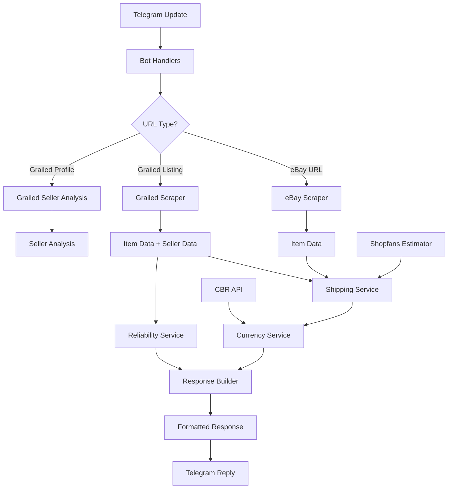

# Price Bot Documentation

A Telegram bot that calculates total costs for eBay and Grailed listings including shipping to Russia and commission fees, with comprehensive seller reliability analysis.

## Overview

This bot provides intelligent price calculation and seller analysis for online marketplace purchases:

- **Multi-platform support**: eBay and Grailed integration
- **Smart commission system**: Tiered pricing based on item value (including US shipping for items ≥$150)
- **Russian customs duty**: Automatic 15% calculation for imports exceeding 200 EUR threshold
- **Multi-currency support**: EUR/USD and USD/RUB conversion via Central Bank of Russia API
- **Shipping estimation**: US domestic + Russia delivery via Shopfans
- **Structured pricing**: Two-tier breakdown with intermediate subtotal and additional costs
- **Seller analysis**: Comprehensive reliability scoring for Grailed sellers

## Quick Start

### Installation

```bash
# Clone the repository
git clone https://github.com/iegorov553/price-gh-bot.git
cd price-gh-bot

# Install dependencies
pip install -r requirements.txt

# Set environment variables
export BOT_TOKEN="your_telegram_bot_token"
```

### Local Development

```bash
# Run in polling mode for development
python -m app.main
```

### Production Deployment

Deploy to Railway for production use with webhook mode:

```bash
railway up
```

## Architecture

The application follows a modular async architecture:



### Key Components

| Component | Purpose | Location |
|-----------|---------|----------|
| **Bot Handlers** | Message processing and user interaction | `app/bot/` |
| **Scrapers** | eBay and Grailed data extraction | `app/scrapers/` |
| **Services** | Business logic (currency, shipping, reliability) | `app/services/` |
| **Models** | Type-safe data structures | `app/models.py` |
| **Configuration** | Environment and YAML config management | `app/config.py` |

## Features

### Price Calculation

1. **URL Detection**: Extract marketplace URLs from messages
2. **Concurrent Scraping**: Parallel data fetching for performance
3. **Shipping Estimation**: US + Russia delivery cost calculation
4. **Commission Application**: Tiered fee structure
5. **Currency Conversion**: Live USD to RUB rates with markup
6. **Enhanced Response Formatting**: Multi-line structured pricing breakdown with clear cost separation

### Seller Reliability Analysis (Grailed)

Comprehensive 100-point scoring system:

- **Activity (0-30 points)**: Days since last listing update
- **Rating (0-35 points)**: Average seller rating (0-5.0 scale)
- **Review Volume (0-25 points)**: Total number of reviews
- **Badge (0-10 points)**: Trusted Seller verification

**Categories:**
- 💎 Diamond (85-100): Top-tier seller
- 🥇 Gold (70-84): High reliability
- 🥈 Silver (55-69): Normal reliability
- 🥉 Bronze (40-54): Increased risk
- 👻 Ghost (<40): Low reliability

## Example Responses

### Enhanced Price Display

The bot now uses a structured multi-line format for better readability:

```
💰 Расчёт стоимости

Товар: $125.00
Доставка в США: $15.00
Доставка в РФ: $22.50
Итого: $162.50

Комиссия: $15 (фикс. сумма)
──────────────────
Итого к оплате: $177.50
В рублях: ₽18,637

Продавец: 💎 Diamond (92/100)
Продавец топ-уровня, можно брать без лишних вопросов
```

### Seller Analysis

```
Анализ продавца Grailed

Надёжность: 💎 Diamond (92/100)
Продавец топ-уровня, можно брать без лишних вопросов

Детали:
• Активность: 30/30 (обновления сегодня)
• Рейтинг: 35/35 (4.9/5.0)
• Отзывы: 25/25 (245 отзывов)
• Бейдж: 10/10 (Проверенный продавец)
```

## Configuration

### Environment Variables

| Variable | Required | Description |
|----------|----------|-------------|
| `BOT_TOKEN` | ✅ | Telegram bot token |
| `PORT` | ❌ | Server port (default: 8000) |
| `RAILWAY_PUBLIC_DOMAIN` | ❌ | Railway domain for webhooks |

### YAML Configuration

The bot supports external configuration via YAML files:

- `app/config/fees.yml`: Commission rates and shipping costs
- `app/config/shipping_table.yml`: Item weight patterns for shipping estimation

## Development

### Code Quality

```bash
# Linting and formatting
ruff .

# Docstring validation
pydocstyle .

# Type checking
mypy app/

# Testing
pytest
```

### Comprehensive Testing

**📖 Complete Testing Documentation**: [TESTING.md](TESTING.md)

The project includes a sophisticated 3-level testing framework:

```bash
# Fast unit tests during development
BOT_TOKEN=<BOT_TOKEN> pytest tests_new/unit/ -v

# Integration tests with component interaction
BOT_TOKEN=<BOT_TOKEN> pytest tests_new/integration/ -v

# End-to-end tests with real external services
BOT_TOKEN=<BOT_TOKEN> pytest tests_new/e2e/ -v

# All tests via Makefile
make test-all

# Docker isolated testing
docker-compose -f docker-compose.test.yml up test-all
```

**Key Testing Features:**
- Contract testing for business logic validation
- Auto-updating test data synchronized with external services
- GitHub Actions CI/CD pipeline with comprehensive checks
- Docker containerized testing for consistency
- Performance benchmarking and coverage reporting

### Documentation

```bash
# Serve documentation locally
mkdocs serve

# Build documentation
mkdocs build
```

### Contributing

1. Follow Google-style docstrings for all functions
2. Maintain type safety with Pydantic models
3. Add tests for new functionality
4. Update documentation for API changes

## Technical Stack

- **Async Framework**: `aiohttp` with connection pooling
- **Type Safety**: Pydantic models for data validation
- **Configuration**: YAML + environment variable management
- **Testing**: pytest with async support
- **Documentation**: MkDocs with automatic API reference generation
- **Deployment**: Railway platform with webhook support

---

For detailed API documentation, see the [API Reference](api/main.md) section.
