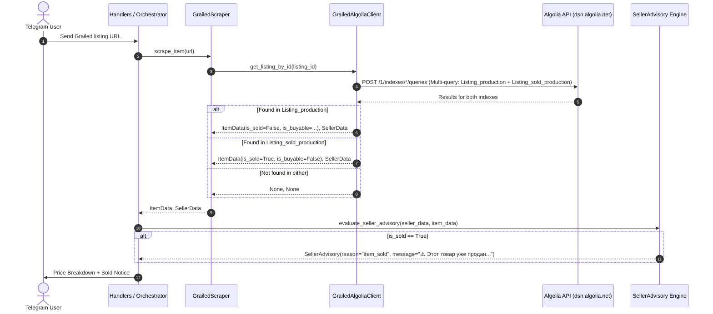

# Design Specification: Grailed Sold Index Support

## 1. Overview and Problem Statement
Currently, `GrailedAlgoliaClient` queries only the active listings index (`Listing_production`). When a user submits a link to a listing that has already been purchased/sold on Grailed, the active index returns 0 hits. Consequently, the bot reports that the listing cannot be found.

Grailed maintains a separate search index `Listing_sold_production` containing over 4.8 million sold listings with full historical price, shipping, cover image, and seller data.

This specification introduces multi-index Algolia querying to automatically detect sold listings, perform reference price calculations, and provide an explicit informational advisory warning to the user.

---

## 2. Architecture & Data Flow



---

## 3. Detailed Component Specifications

### 3.1 Data Model (`app/models.py`)
Add `is_sold: bool = False` to `ItemData`:
```python
class ItemData(BaseModel):
    price: Decimal
    shipping_us: Decimal = Decimal("0")
    is_buyable: bool = True
    is_sold: bool = False
    title: str | None = None
    image_url: str | None = None
```

### 3.2 Configuration (`app/config.py`)
Add `sold_index_name` to `GrailedAlgoliaConfig`:
```python
class GrailedAlgoliaConfig(BaseSettings):
    app_id: str = Field(default="MNRWEFSS2Q", validation_alias="GRAILED_ALGOLIA_APP_ID")
    api_key: str = Field(default="c89dbaddf15fe70e1941a109bf7c2a3d", validation_alias="GRAILED_ALGOLIA_API_KEY")
    index_name: str = Field(default="Listing_production", validation_alias="GRAILED_ALGOLIA_INDEX_NAME")
    sold_index_name: str = Field(default="Listing_sold_production", validation_alias="GRAILED_ALGOLIA_SOLD_INDEX_NAME")
    timeout_sec: float = Field(default=5.0, validation_alias="GRAILED_ALGOLIA_TIMEOUT_SEC")
```
Update `.env.example` to document `GRAILED_ALGOLIA_SOLD_INDEX_NAME`.

### 3.3 Algolia Client (`app/services/grailed_algolia.py`)
Update `get_listing_by_id`:
```python
payload = {
    "requests": [
        {
            "indexName": self.index_name,
            "params": f"filters=id%3D{listing_id}&hitsPerPage=1",
        },
        {
            "indexName": self.sold_index_name,
            "params": f"filters=id%3D{listing_id}&hitsPerPage=1",
        },
    ]
}
```
Result resolution:
- If `results[0]["hits"]` is non-empty:
  - Active listing hit.
  - `is_sold = False`
  - `is_buyable = bool(hit.get("buynow", False))`
- If `results[0]["hits"]` is empty and `results[1]["hits"]` is non-empty:
  - Sold listing hit.
  - `is_sold = True`
  - `is_buyable = False`
- Else:
  - Return `(None, None)`

### 3.4 Seller Advisory Engine (`app/services/seller_advisory.py` & `app/bot/messages.py`)
In `app/bot/messages.py`:
```python
ITEM_SOLD_MESSAGE = (
    "⚠️ Этот товар уже продан на Grailed (архивное объявление).\n"
    "Выкуп невозможен, расчет стоимости приведен для справки."
)
```

In `app/services/seller_advisory.py`:
Check `item_data.is_sold` first before other buyability checks:
```python
if item_data and getattr(item_data, "is_sold", False):
    return SellerAdvisory(
        reason="item_sold",
        message=ITEM_SOLD_MESSAGE,
    )
```

---

## 4. Error Handling and Resilience
- **HTTP 403 / 429 / Timeout:** Handled gracefully as before; returns `(None, None)`.
- **Malformed Hits:** Safe dictionary parsing with fallbacks for missing shipping or seller score attributes.
- **Both Indexes Empty:** Return `(None, None)`, standard not found error message in UI.

---

## 5. Testing & Verification Plan
1. **Unit Tests (`tests_new/unit/test_config.py`):**
   - Test default `sold_index_name` and env override `GRAILED_ALGOLIA_SOLD_INDEX_NAME`.
2. **Unit Tests (`tests_new/unit/test_grailed_algolia_client.py`):**
   - Test active item hit returns `is_sold=False`.
   - Test sold item hit returns `is_sold=True`, `is_buyable=False`.
   - Test both indexes returning 0 hits returns `(None, None)`.
3. **Unit Tests (`tests_new/unit/test_seller_assessment.py`):**
   - Test `is_sold=True` generates advisory reason `"item_sold"` and message `ITEM_SOLD_MESSAGE`.
4. **Integration Tests (`tests_new/integration/test_grailed_orchestration.py`):**
   - Test end-to-end orchestration for sold listing URL generating price calculation + sold advisory warning.
5. **Live Verification (`scripts/probe_grailed_algolia.py`):**
   - Verify with live sold listing ID `94370655` and active listing ID `99406229`.
